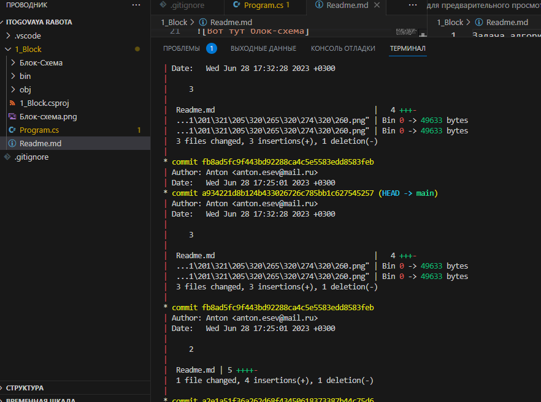

Задача алгоритмически не самая сложная, однако для полноценного выполнения проверочной работы необходимо:

Создать репозиторий на GitHub
Нарисовать блок-схему алгоритма (можно обойтись блок-схемой основной содержательной части, если вы выделяете её в отдельный метод)
Снабдить репозиторий оформленным текстовым описанием решения (файл README.md)
Написать программу, решающую поставленную задачу
Использовать контроль версий в работе над этим небольшим проектом (не должно быть так, что всё залито одним коммитом, как минимум этапы 2, 3, и 4 должны быть расположены в разных коммитах)
Задача:

Написать программу, которая из имеющегося массива строк формирует новый массив из строк, длина которых меньше, либо равна 3 символам. Первоначальный массив можно ввести с клавиатуры, либо задать на старте выполнения алгоритма. При решении не рекомендуется пользоваться коллекциями, лучше обойтись исключительно массивами.

Примеры:

[“Hello”, “2”, “world”, “:-)”] → [“2”, “:-)”]
[“1234”, “1567”, “-2”, “computer science”] → [“-2”]
[“Russia”, “Denmark”, “Kazan”] → []

Описание алгоритма решения
Сначало объявляется два массива: изначальный и вторый такой же длины. Потом метод, в котором цикл соразмерный длине массива, внутри цикла проверка условия ( <=3 ), если да элемент первого массива заносится в count элемент второго массива. Переменная count чтобы поочередно закидывать из первого массива во второй и чтобы потом не было пробелов. После присвоения увеличивается переменная count на 1 и возвращается к циклу for в котором i увеличивается на 1. И так проверяется до конца.

Так же прилагаю скриншот коммитов

